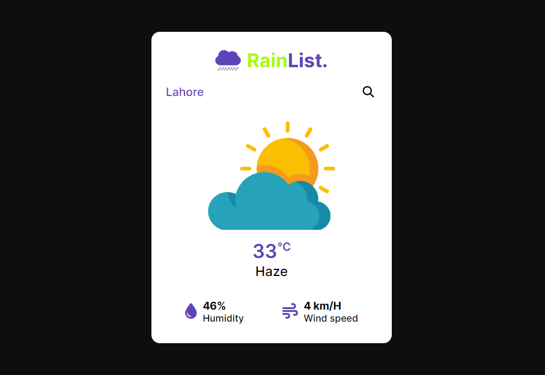

# RainList Weather App
## Project Info:
- A simple app that displays the weather details like temperature, humidity and wind speed based on given location.
- The main purpose of building this project was to practice and get familiar with using third-party APIs and making API calls.
### Built With:
- HTML, CSS and JavaScript.
- CSS Flexbox for Layout.
- javaScript Event Handling and DOM Manipulation for Interactivity.
- Preview:

### Links:
- [Live Site on Netlify.](https://rainlist.netlify.app/))
- [My Twitter Profile.](https://twitter.com/the_soban3)
- [My LinkedIn Profile.](https://linkedin.com/in/sobans)
